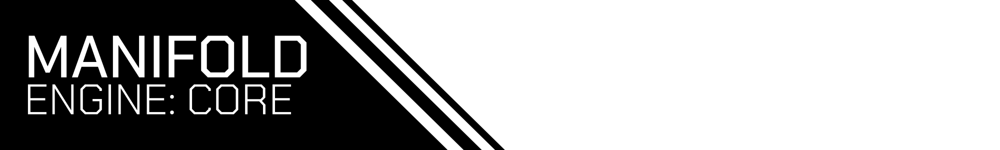

---

## Every game engine sucks... this one sucks on my own terms.
I've had gripes/nitpicks with every engine I've used. So I'm making my own that I'll hopefully use in the future.\
Contributions are welcome.

### Features
- Uses the new SDL3 Framework.
- Haxe is supported via [HashLink](https://hashlink.haxe.org/). However, C++ can be used for logic as well.

### Disclaimer
- The engine isn't currently in a usable state.
- This is my excuse to learn both languages.
- There might be a lot of amateur/beginner mistakes. Both in Haxe and C++.
- No documentation whatsoever.

### Usage
Add this repository as a submodule and use CMake. **Make sure to update your submodules recursively.**
```cmake
add_subdirectory(vendor/MANIFOLDEngine EXCLUDE_FROM_ALL)

add_executable(MyAwesomeGame src/game.cpp)
ME_configure(MyAwesomeGame) # This function adds dependencies and custom commands that are required.
```
